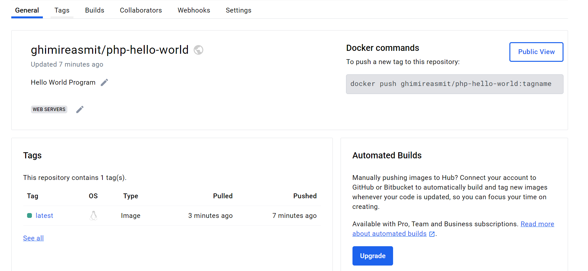
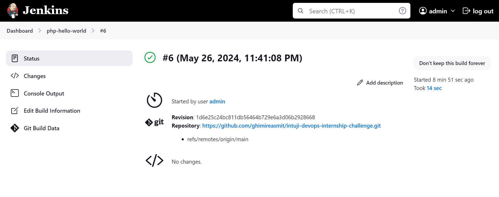

# PHP Hello World

This project demonstrates the process of setting up a simple PHP application using Docker and Jenkins for CI/CD pipeline. Below are the steps to get started.

## Step 1: Install Docker

Create a bash script file `docker.sh` to install Docker. Execute the bash script using the following commands:

```bash
chmod +x docker.sh
./docker.sh
```

## Step 2: Clone the GitHub Repository

Clone the repository using the `git clone` function:

```bash
git clone https://github.com/silarhi/php-hello-world.git
cd php-hello-world
```

## Step 3: Create a Dockerfile

Create a `Dockerfile` in the root folder of the cloned repository.

## Step 4: Build and Push Docker Image to Docker Hub

Build the Docker image and push it to Docker Hub with the following commands:

```bash
docker build -t ghimireasmit/php-hello-world .
docker login --username=ghimireasmit
docker push ghimireasmit/php-hello-world
```

## Step 5: Create a docker-compose.yml File

Create a `docker-compose.yml` file and run the following command to start the application:

```bash
docker-compose up
```

## Step 6: Install Jenkins and Set Up CI/CD Pipeline

Create a bash script file `install_jenkins.sh` to install Jenkins. Access Jenkins at `http://localhost:8080` and follow the setup instructions.

## Step 7: Create a Jenkins Freestyle Project

1. Go to Jenkins Dashboard.
2. Click on "New Item".
3. Name the project "PHP Hello World" and select "Freestyle project".
4. In the "Source Code Management" section, select "Git" and provide the repository URL: `https://github.com/ghimireasmit/intuji-devops-internship-challenge.git`.
5. In the "Build" section, add a build step to execute a shell script:
   
   ```bash
   docker build -t ghimireasmit/php-hello-world .
   docker push ghimireasmit/php-hello-world
   ```

6. Save and build the project.



